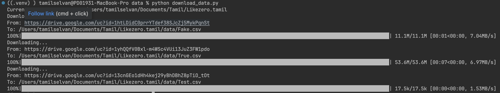
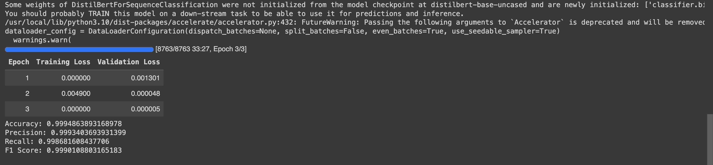

# 💻 Likezero NLP Task: Fake and Real News Detection

## 👩🏽‍🚀 1. Purpose
The task is to build a machine learning model capable of classifying news articles as either fake or real. This involves testing different methods of feeding text data into the model, performing basic feature engineering, data pre-processing, and text manipulation.

## 🦿 2. Implementation Details

### 2.1 Initial Steps

The initial step involved building an exploratory data analysis (EDA) report to gain insights into the dataset. This included checking for missing values, distributions, and generating word clouds for both the true and fake news datasets.

### 2.2 EDA Findings

- **Data Imbalance:** The truth data comprises a greater number of records than the fake dataset, potentially leading to issues related to data imbalance during training.
  
- **Missing Values:** The fake dataset contains numerous NaN values that need to be addressed before training the model to avoid potential impacts on the training process.

- **Dataset Size:** The overall dataset is relatively small, which may result in lower accuracy. However, there is a risk of overfitting due to the limited data size.

### 2.3 Model Selection

For this application, the `DistilBertForSequenceClassification` model from the Transformers library was chosen. This model was selected due to its effectiveness in handling NLP tasks and its capability for fine-tuning with pretrained weights. Utilizing this model allows for improved accuracy in classifying real vs fake news.

### 2.4 Training

The training process involved setting up a notebook to prototype the model and then transitioning to production-level code. Preprocessing steps were incorporated to enhance training results from an NLP perspective. Google Colab with GPU resources was utilized for faster training, and the trained model was saved for inference.

#### Training Results
``` bash
Accuracy: 0.9995
Precision: 0.9993
Recall: 0.9987
F1_Score: 0.9990
```

### 2.5 Inference

To evaluate the model's performance, a test dataset was created with a mix of real and fake news, including some samples generated by ChatGPT.
> I personally prefer utilizing ChatGPT for various tasks. In my view, those who don't leverage AI for productivity are lagging behind by at least a decade in terms of technological advancement

 An inference code was developed to read the test dataset, make predictions, and compare them with the ground truth labels. The accuracy of the model on this test dataset was above 80%, acknowledging potential confusions especially with artificially generated data.


## 🤌🏼 3. Dependencies/Prerequisites

- `Python 3.11.0`
- It is recommended to have a virtual environment (venv) set up for this project.

### Python Packages:
``` bash
- torch
- transformers
- pandas
- scikit-learn
- matplotlib
- seaborn
- wordcloud
- ipykernel
- accelerate
- python-dotenv
- nltk
- gdown
```

## 🚀 4. Getting Started with Installation and Running the Scripts

### Install Prerequisites

1. Clone the project repository.
2. Ensure Python environment is set up.

```bash
pip install -r requirements.txt
pip install accelerate -U
```
### Dataset Download

3. Once the installation is complete, download the datasets from my Google Drive.
```bash
cd data
python download_data.py
```
This will download `True.csv`, `Fake.csv`, and `Test.csv` in the `data` folder.



### Model Training

4. Now that everything is set up, proceed to train the model. Navigate back to the root folder of the repository and execute the following command:
```bash
cd model_training
python train.py

```
5. This command will initiate training using `True.csv` and `Fake.csv` data. All configuration elements are specified in the `.env` file within the same folder. Once training is complete, the trained weights will be saved in the model directory.



### Model Inference
6. After training, proceed to perform model inference on the test dataset `Test.csv`. You can skip the training step if you wish to use the pre-trained model that I trained. To perform inference, execute the following command from the root folder of the repository:
```bash
cd model_inference
python model_inference.py

```
7. This will download my trained weights from my Google Drive into a `fine_tuned_model` directory within the repository and start the inference process on `Test.csv`. If you have a different CSV, you can update the path in the .env file within the same folder. The inference process will predict labels and save them as a CSV file. Additionally, it will validate against ground truth labels in the test CSV and print the accuracy. 


## 5. 🤖 Code Summary

### 5.1 Model Training
### `train.py`

This script is responsible for training a DistilBERT model for news text classification. The code demonstrates how to train a DistilBERT model for news text classification, handle class imbalances using class weights, and evaluate model performance using standard evaluation metrics. It consists of the following components:

1. **Data Loading and Preprocessing**: The script loads the dataset, preprocesses it, and splits it into training and testing sets. Also, handled data imbalance at the label weights level.

2. **Custom Dataset Class**: It defines a custom dataset class (`NewsDataset`) to prepare the data for training. This class tokenizes and encodes news text using a `DistilBERT` tokenizer.

3. **Custom Trainer Class**: It extends the `Trainer` class from the Hugging Face `transformers` library to incorporate class weights in the loss function. This enables handling of imbalanced datasets during training.

4. **Training and Evaluation Functions**: It includes functions to train the model (`train_model`) and evaluate its performance (`evaluate_model`). These functions use the `Trainer` class for training and calculate metrics such as accuracy, precision, recall, and F1 score.

5. **Main Function**: The `main()` function orchestrates the entire training process. It loads environment variables, preprocesses the data, initializes the tokenizer and model, calculates class weights, sets training arguments, trains the model, evaluates its performance, and optionally saves the trained model.

---

### `utils.py`

This module contains utility functions used for data preprocessing and loading. The code showcases effective data preprocessing techniques for preparing text data for training a news text classification model. It utilizes `NLTK` for stopword removal and regular expressions for text cleaning. Additionally, it demonstrates best practices for handling missing values and converting text to a suitable format for machine learning. Key functionalities include:

1. **Removing Stopwords**: It defines a function (`remove_stopwords`) to remove stopwords from text using NLTK's stopwords corpus.

2. **Data Processor Class**: It defines a class (`DataProcessor`) responsible for loading and preprocessing fake and true news data for training. The class includes methods to load data from specified paths, preprocess the combined dataset, handle missing values, convert text to lowercase, remove punctuation, extra whitespaces, special characters, non-alphanumeric characters, and stopwords.

   - `load_data()`: Loads fake and true news data from specified paths and combines them into a single dataframe.
   
   - `preprocess_data()`: Preprocesses the combined fake and true news data by removing missing values, replacing 'nan' text with empty strings, converting text to lowercase, removing punctuation, extra whitespaces, special characters, non-alphanumeric characters, and stopwords.
   
   - `get_preprocessed_data()`: Retrieves the preprocessed fake and true news data.

---


### 5.2 Model Inference 
### `model_inference.py`

This script is designed to perform inference using a fine-tuned `DistilBERT model` for news text classification. It includes the following components:

1. **Data Loading and Preprocessing**: The script loads data from a specified path, preprocesses it, and prepares it for inference. Preprocessing involves removing missing values, converting text to lowercase, removing punctuation, special characters, and stopwords.

2. **Custom Dataset and DataLoader**: It defines a custom dataset class (`NewsDataset`) and uses PyTorch's `DataLoader` to efficiently load data for inference. The dataset class tokenizes and encodes news text using a DistilBERT tokenizer.

3. **Model Loading and Inference**: The script loads the fine-tuned DistilBERT model and tokenizer. It then performs inference on the preprocessed data, generating predictions for each news article.

4. **Result Analysis and Saving**: After inference, the script maps the predictions to corresponding labels ('Real' or 'Fake'). If ground truth labels are available, it calculates accuracy and saves the results to a specified path.

### `utils.py`

This module contains utility functions used for data preprocessing. Key functionalities include:

1. **Data Loading**: It loads prediction data from a specified path.

2. **Data Preprocessing**: It preprocesses the prediction data by removing missing values, converting text to lowercase, removing punctuation, special characters, and stopwords.

3. **Stopword Removal**: It defines a function to remove stopwords from text using NLTK's stopwords corpus.


## 6. 🥷🏻 Potential improvements that I could have done more
1. **Model Architecture Optimization**: Experiment with different pre-trained models or custom architectures to find the most suitable one for the task, considering factors like performance and computational resources.

2. **Hyperparameter Tuning**: Fine-tune hyperparameters such as learning rate, batch size, and optimizer choice to enhance model performance and convergence.

3. **Data Augmentation Techniques**: Implement methods like back-translation, synonym replacement, or noise addition to increase the diversity of the training data and improve model generalization.

4. **Class Imbalance Handling**: Explore techniques like re-sampling, class weighting, or generating synthetic samples to address class imbalance issues and ensure the model learns effectively from all classes.

5. **Containerized Deployment with FAST API**: Dockerize the trained model and deploy it as a containerized service using FAST API, enabling seamless integration, scalability, and easy consumption through RESTful API endpoints.

## 🤔 7. How much time i took? 
I began this assignment amidst personal challenges, leading me to work in various time blocks. On average and overall, I dedicated approximately `10 to 12 hours`, including multiple training iterations, to complete the task. Oops!! excluding this crazy 😬 readme file!!

## 👨🏻‍💻 Author Information

- **Author:** Tamil Selvan
- **Email:** selva221724@gmail.com
- **LinkedIn:** [Tamil Selvan](https://www.linkedin.com/in/selva221724/)
- **GitHub:** [selva221724](https://github.com/selva221724)
- **Stack Overflow:** [Tamil Selvan](https://stackoverflow.com/users/10383650/tamil-selvan)